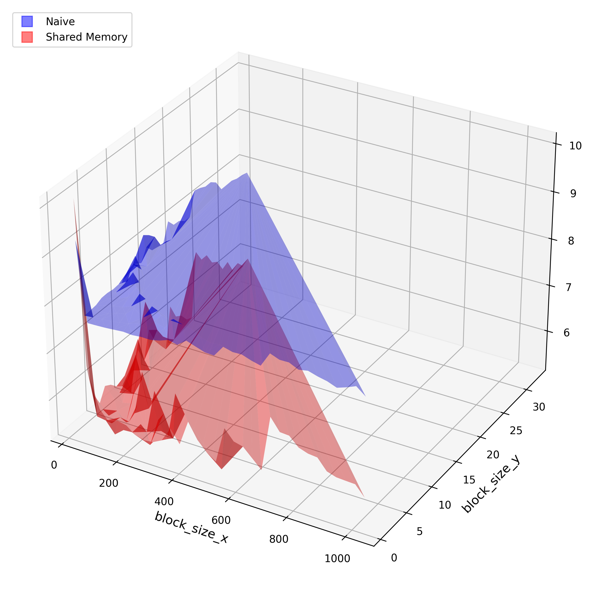
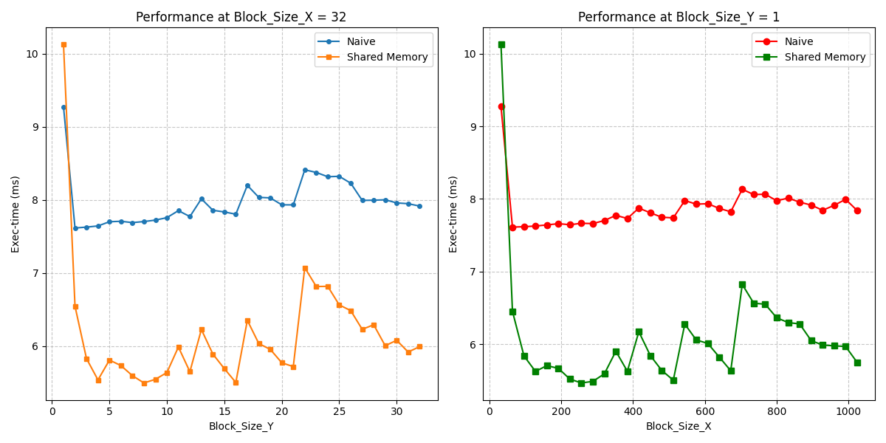

# CUDA 并行策略

王宇康 2024010091 计51  

## 测量结果  

整体测量结果如下图，block_size_x, block_size_y 分别为 x, y 轴，time 为 z 轴  

  

图1<\p>

具体而言，分别选取了固定 block_size_x = 32 和 block_size_y = 1 的两种情况，对其他指标进行展示  

  

图2<\p>

## 原因分析  

对于这个程序

1. 如何设置 thread block size 才可以达到最好的效果？为什么？

对于这个程序，可以发现总体上随着 block_size_x 和 block_size_y 的增大，所花费的时间是有所增加的，也就是说 block_size 并非越大越好  

由于 CUDA 的执行基本单位是 Wrap（32个线程），所以 block_size_x = 32 设为 32 的倍数可以确保内存访问的高效性  

而对于 block_size_y 来说，线程总数 x * y 不应太大，否则会导致寄存器或者 shared memory 资源紧张，太小会导致内存利用低，导致内存访问的时间占比大，因此 200~500 之间比较合适（由图2右侧显示）

综合考虑以上原因并结合实际数据，block_size_x = 64, block_size_y = 4 或者 block_size_x = 128, block_size_y = 2 在本次实验表现效果最好  

2. Shared memory 总是带来优化吗？如果不是，为什么？  

不是，但在绝大多数情况下都能带来优化  

shared memory 的优势在于减少对 global memory 的重复读取，但如果程序的计算密度过低，比如此次实验的卷积核只有 3 * 3，可能 cpu L1缓存就能处理好重复数据  

并且如果程序核函数中包括大量的分支，warp 内线程执行任务不同，也会降低指令执行速度  

比如在图2两幅图的最左端，都出现了 naive 花费时间小于 shared memory 的情况  

3. Shared memory 在什么 thread block size 下有效果，什么时候没有？

根据实验结果显示，在 block 比较大的情况下，block_size_x * block_size_y >= 64 就开始表现出明显的优势  

而在 block 较小，如 block_size_x * block_size_y = 32 时效果更差

4. 还有哪些可以优化的地方？

对于一些固定的数据可以放在 \_\_consant\_\_ 中  

减少 if-else 分支，可以采用增多线程来加载数据  

## 参数选择  

对于任意一个程序  

1. 应该如何设置 thread block size？

block_size_x 必须是 32 的倍数  

总量保持在一定数量，256~624 之间为宜   

也可以采用本次实验中遍历 block_size_x 和 block_size_y 的方法找出最合适的参数

2. 应该如何决定 shared memory 的使用？

分析一个数据是否会被多次读取，像本次实验中卷积运算，一个数据可能会被读取 9 次，则应该使用  

并且保证计算有一定的复杂性，计算密度比较大